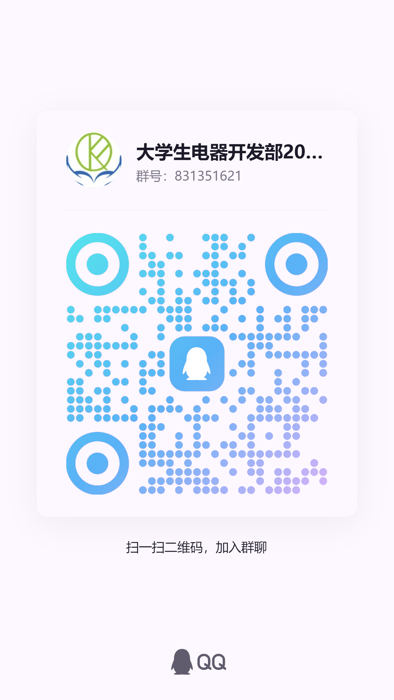

---
---
# 介绍

 Hpu-Api接口是创建于2024.10月的个人测试小项目，开箱即用的河南理工大学教务请求，根据请求的接口逆向做的，起初是用于个人目的。目前已经转为公益项目，由comefly维护，为大家提供服务，可以自己部署使用。

## 关于“开源项目”的声明

接口仅供个人使用和学习，不得用于商业用途，仅做学习交流，违法使用请自行承担。

## 目前提供的服务

目前，线上版本代号为：“**v1**”, 目前给开发者如下接口：

::: tip
欢迎大家 Star our project!
[GitHub](https://github.com/HPUhushicheng/HPU-API)
>穿插一则
>欢迎河理的学弟学妹加入*大学生电器开发部*,这是一个开放包容的大家庭。不仅可以学习到嵌入式和深度学习，web设计等技术，还可以认识更多志同道合的朋友。
>
>
:::

    
     
    
大学生电器开发部2024交流群

好了，话不多说，我们开始我们的实践。
